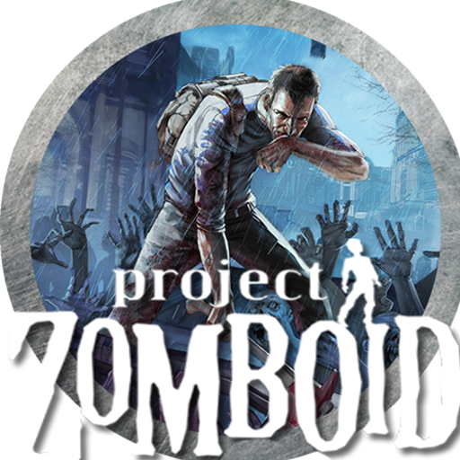

# Zomboid Save Manager

<p align="center">
  
</p>

A private, browser-based tool for inspecting, backing up, and recovering Project Zomboid saves. Save files are processed entirely on the user's device and are never uploaded to the application server.

## Live application

**[Open Zomboid Save Manager on Vercel](https://zomboid-save-manager.vercel.app)**

## Features

- Import an individual Project Zomboid save folder or a ZIP archive.
- Validate `players.db` integrity locally with SQLite compiled to WebAssembly.
- Detect characters stored in `localPlayers` and `networkPlayers`.
- Display each character's name, source, life status, and last saved position when available.
- Export a complete backup as a new ZIP without modifying the original save.
- Recover dead characters using one of two recovery modes.
- Generate SHA-256 hashes and a manifest for every exported package.
- Process SQLite and ZIP operations in the browser, including inside a dedicated Web Worker.

## Privacy

The web application is designed so that save data stays on the user's computer:

- No save file is uploaded to Vercel or any other server.
- No character name, save history, or recovery history is persisted remotely.
- The selected folder permission exists only for the current browser session.
- The original save is opened for reading and remains unchanged.
- Backups and recovered saves are generated as separate ZIP files.

Vercel only serves the application assets. File inspection, SQLite queries, hashing, recovery, and compression run locally in the browser.

## How to use

1. Open the [live application](https://zomboid-save-manager.vercel.app).
2. Select the folder for one specific save, or import a ZIP containing that save.
3. Wait for the application to validate `players.db` and scan its characters.
4. Review the detected save and character information.
5. Export a backup, or choose a dead character to create a recovery package.
6. Keep the original save in a safe location before installing any generated package.

On Windows, saves are usually stored under:

```text
C:\Users\YOUR_USER\Zomboid\Saves\<GAME_MODE>\<SAVE_NAME>
```

Select `<SAVE_NAME>`, not the parent `Saves` directory. A compatible save must contain both `players.db` and `map_ver.bin`.

## Character recovery

Two recovery modes are available:

### Revive as-is

Creates a copy of the save in which the selected character's `isDead` value is reset. All other serialized character data remains unchanged.

### Full-health recovery

Creates the recovered save and includes the one-shot **Zomboid Save Manager Recovery** mod. When the recovered save is loaded, the mod restores health and removes wounds and infection for the selected character.

Every recovery package includes:

- the recovered save under `save/<SAVE_NAME>`;
- `manifest.json` with input and output hashes;
- `README_RECOVERY.txt` with installation instructions;
- the recovery mod when full-health recovery is selected.

The browser never overwrites the imported source. Installing the generated package is always a separate, explicit step performed by the user.

## Browser support

A current Chromium-based browser such as Chrome, Edge, or Brave provides the best folder-selection and direct-save experience. ZIP import and regular browser downloads are available when the native folder or file-save APIs are not supported.

## Technology

- Next.js 16 and React 19
- TypeScript
- Tailwind CSS
- TanStack Query
- `sql.js` / SQLite WebAssembly
- `@zip.js/zip.js`
- Web Workers
- Web Crypto API

## Local development

Requirements:

- Node.js 24
- npm

Install dependencies:

```powershell
npm ci
```

Run the web application in PowerShell:

```powershell
$env:ZSM_RUNTIME_MODE = "web"
npm run dev
```

Then open [http://localhost:3000](http://localhost:3000).

For Bash-compatible shells:

```bash
ZSM_RUNTIME_MODE=web npm run dev
```

## Verification

```powershell
npm run typecheck
npm run lint
npm test
npm run build
```

## Deployment

The project is deployed on Vercel. Vercel environments are detected automatically, so the browser-only runtime is enabled without additional environment variables.

Repository: [github.com/luizlima12/zomboid-save-manager](https://github.com/luizlima12/zomboid-save-manager)
